# Tertulia

**A self-hosted platform that turns a stakeholder co-design workshop into structured product feedback — automatically.**

Named after the Iberian tradition of a gathering where everyone contributes their judgment, Tertulia brings diverse domain experts — firefighters, mayors, scientists, academics — together to co-design around THD Spatial AI tools like Wildfire. It is **one project with two halves that hand off to each other**:

- **The workshop** — a facilitator runs a real-time session where participants build personas, stakeholder maps, user flows, and problem maps together.
- **The feedback pipeline** — when the workshop launches participants into the software under test, an in-app overlay captures their feedback and an AI agent files it as a structured GitHub issue — with each participant's persona already attached from the workshop.

Everything runs fully self-hosted via Docker Compose. No managed cloud, no third-party data processor.

## What Tertulia does — end to end

```mermaid
flowchart LR
    subgraph WS["🗣️  Workshop (Tertulia)"]
        direction TB
        A[Facilitator<br/>creates session] --> B[Participants join<br/>anonymously via QR / URL]
        B --> C[Persona Card] --> D[Stakeholder Map] --> E[User Flow] --> F[Problem Board] --> G[Synced slides]
    end

    subgraph FB["💬  In-app feedback (target app)"]
        direction TB
        APP[🔥 Target app<br/>e.g. Wildfire<br/>+ feedback overlay] --> O[Select area →<br/>screenshot + comment]
    end

    L{{Launch}}
    P[(Feedback<br/>pipeline)]
    I[[Structured<br/>GitHub issue]]
    R[/Workshop report/]

    G ==> L
    L -- "pre-register personas (session_token)" --> P
    L == "redirect + ?tertulia_token" ==> APP
    O -- "persona auto-attached" --> P
    P -- "AI: local Ollama via n8n" --> I
    P -. "Markdown + PDF + Excel" .-> R
```



The key link is the **persona handoff**: at launch, Tertulia pre-registers every participant's persona with the pipeline and carries a `tertulia_token` into the target app, so feedback is attributed to the right reporter and participants never re-enter who they are.

## Features

### 🗣️ Workshop platform
- **Anonymous join** — participants enter with just name / role / org via QR code or URL; no accounts.
- **Facilitator dashboard** — live participant list, phase control, and per-template completion tracking.
- **Real-time sync** — WebSocket hub broadcasts slide index, phase changes, presence, and reactions.
- **Four co-design templates** — Persona Card, Stakeholder Map, User Flow, Problem Board.
- **Synced slides** — embed Google Slides / PDF; the current slide is pushed to everyone.
- **Multilingual** — DE / EN / ES / GL.

### 💬 Feedback pipeline
- **Drop-in overlay** — the `@spatialhub/feedback` React package wraps *any* target app.
- **Rich capture** — drag to select a screen area, auto screenshot, emoji rating, typed comment.
- **Persona handoff** — pre-registered personas mean the overlay skips its persona form for workshop participants.
- **AI issue generation** — local Ollama models orchestrated by n8n turn feedback into a titled, labelled GitHub issue with reporter info, code analysis, and a suggested fix (Groq is an optional accelerator).
- **Workshop reports** — export a run as Markdown + PDF + Excel.
- **App-agnostic** — point it at your own software with `TARGET_APP_NAME` / `GITHUB_REPO`.

## Quick Start

### Everything at once (Docker — recommended)

```bash
make env        # create .env files + generate a per-machine n8n key
# then edit .env and fill in the secrets it lists:
#   PIPELINE_TOKEN, KEYCLOAK_CLIENT_SECRET, AUTH_INTERNAL_SECRET, GITHUB_TOKEN, GITHUB_REPO
make up         # or: make up-cpu   (machine without an NVIDIA GPU)
make models     # pull the two Ollama models used by the pipeline
```

Then import the two n8n workflows from `pipeline/n8n-workflows/` at <http://localhost:5678>.
Services come up on: frontend `:8080`, backend `:8010`, Keycloak `:8185`, feedback pipeline `:9000`, n8n `:5678`.

### Local development (without Docker)

```bash
# Frontend
cd frontend
npm install
cp .env.example .env.local   # fill in auth-service URL + realm
npm run dev                  # http://localhost:5173

# Backend (needs postgres + keycloak + auth-service running, e.g. via docker compose)
cd backend
python -m venv .venv
source .venv/bin/activate     # Windows: .venv\Scripts\activate
pip install -r requirements.txt
cp .env.example .env          # fill in database, auth, + pipeline keys
uvicorn main:app --reload --port 8001
```

## Documentation

| Document | Purpose |
|---|---|
| [docs/requirements/](./docs/requirements/) | Product requirements and user stories |
| [docs/architecture/](./docs/architecture/) | Arc42 architecture documentation |
| [pipeline/README.md](./pipeline/README.md) | Feedback pipeline — overlay, backend, and workshop reports |

## Related Projects

| Project | Path | Role |
|---|---|---|
| Storcito-Wildfire | `../Storcito-Wildfire` | Reference target app participants launch into |
| Feedback pipeline | [`./pipeline`](./pipeline) | AI feedback capture (part of this repo); receives pre-registered personas |

## Tech Stack

- **Frontend**: React 19 + TypeScript + Vite + TailwindCSS v4
- **Backend**: FastAPI (Python 3.11+)
- **Database**: self-hosted PostgreSQL
- **Auth**: Keycloak + Go auth-service (from the Storcito platform)
- **Realtime**: WebSocket (in-process hub)
- **AI**: local Ollama via n8n (optional Groq accelerator)
- **Deploy**: Docker Compose (fully self-hosted)
- **Languages**: DE / EN / ES / GL
