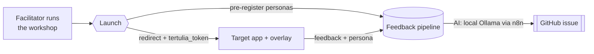

# Introduction & Goals

## Purpose

**Tertulia** is a self-hosted web platform developed by THD Spatial AI that runs structured stakeholder co-design workshops **and** turns each session into structured product feedback. It is one project with two halves:

1. **Workshop** — a facilitator runs a real-time session where domain experts (firefighters, mayors, scientists, academics) collaboratively build personas, stakeholder maps, user flows, and problem maps.
2. **Feedback pipeline** — when the workshop launches participants into the software under test, an in-app overlay captures their feedback and an AI agent files it as a structured GitHub issue, with each participant's persona already attached from the workshop.

Its first deployment targets the **Wildfire** platform — a geospatial wildfire risk simulation tool — but the feedback half is app-agnostic and can be pointed at any React app.

### End-to-end flow

The launch phase is the hinge: personas are pre-registered with the pipeline and a `tertulia_token` is carried into the target app so feedback is attributed to the right reporter without re-entry.

## Architectural Goals

| Priority | Goal | Description |
|---|---|---|
| 1 | Real-time collaboration | All participants see live updates with < 500ms latency |
| 2 | Zero friction for participants | No account creation, no installation, join by URL or QR code |
| 3 | Facilitator control | Single facilitator drives the session pace and template unlocking |
| 4 | Feedback integration | Participant personas feed automatically into the built-in feedback pipeline (`pipeline/`) |
| 5 | Multilingual | Full DE / EN / ES / GL support from day one |
| 6 | Tablet-first | Usable on tablets and laptops without horizontal scroll |
| 7 | Self-hosted | Runs fully on-premise via Docker Compose; no third-party cloud or managed-service dependency |

## Stakeholders

| Role | Interest in the System |
|---|---|
| Workshop Facilitator (THD Spatial AI) | Creates and controls sessions; sees live participant progress |
| Domain Expert Participant | Firefighter, mayor, scientist, academic — fills templates, provides real-world knowledge |
| Developer (THD Spatial AI) | Consumes workshop outputs (personas, flows) for product decisions |
| Feedback pipeline (built-in, automated) | Receives pre-registered personas and turns in-app feedback into GitHub issues |

## Quality Goals

| Quality | Scenario |
|---|---|
| Availability | Platform is reachable for a workshop at 10:00 AM with 30+ participants joining simultaneously |
| Consistency | Slide index and phase changes propagate to all participants within 500ms |
| Privacy | Participants are anonymous — no email, no password, no persistent user account |
| Maintainability | A single developer can understand and modify any feature module independently |
| Internationalization | All visible strings are translated in DE, EN, ES, GL — no hard-coded English |
